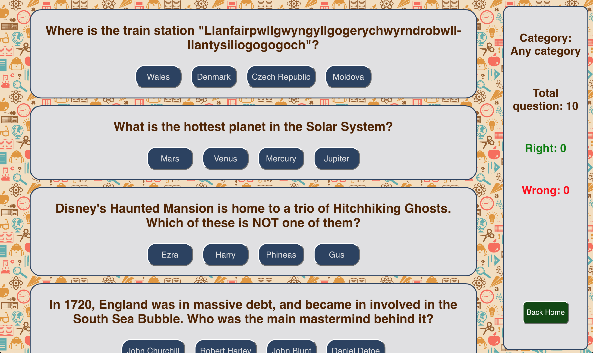
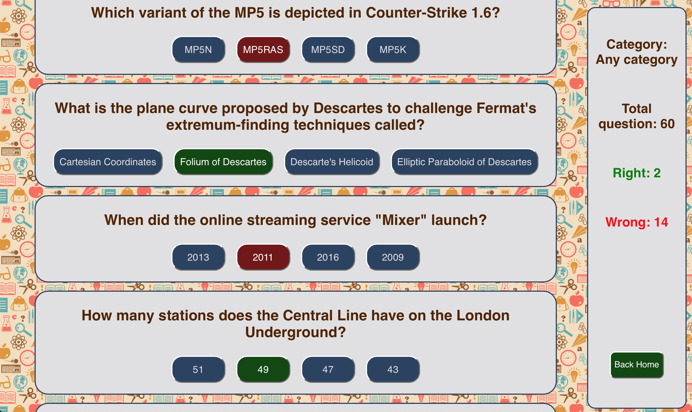

# Quiz app in javascript.
## The same quiz app built in vanilla javascript and in React js.

- The questions are fetched from open trivia database https://opentdb.com/api_config.php

- The React one is done with the help of react-router-dom 

- The vanilla javascript version is built without JQuery or other library.

- There is an infinite scrolling that loads infinite question, the possibility to aswer only once for question and all the media query for the smartphones.

